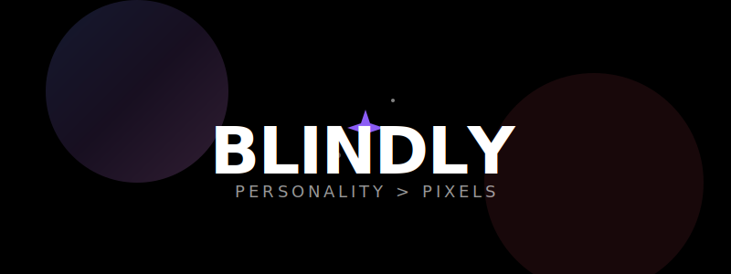

<section align="center">
  
  <p align="center">
    <b>A dating app that prioritizes soul over selfies.</b>
  </p>
  <p align="center">
    
    
    
    
  </section>

---

## 🖤 The Philosophy
Most dating apps feel like a meat market. **Blindly** is different. It’s built for the thinkers, the overthinkers, and those who believe that words have more weight than lighting.

- **No Images**: You see their words, their thoughts, and their "handles".
- **One Match at a Time**: No infinite roster. One match, one focus.
- **AMOLED-First**: A deep, pure black design system that lets the text breathe.

---

## ✨ Features

<table width="100%">
  <tr>
    <td width="33%" align="center">
      <br/>
      <b>Text-Driven Discovery</b><br/>
      Swipe through profiles defined by taglines and prompts.
    </td>
    <td width="33%" align="center">
      <br/>
      <b>Real-time Chat</b><br/>
      Messaging that feels instant, private, and focused.
    </td>
    <td width="33%" align="center">
      <br/>
      <b>Framer Physics</b><br/>
      Buttery smooth swipe gestures and spring-driven UI.
    </td>
  </tr>
</table>

---

## 🛠 Tech Stack

- **Frontend**: React 18 + Vite
- **Styling**: Native CSS Design System (Tailwind-free)
- **Database**: Firestore (Real-time syncing)
- **Auth**: Firebase Auth (Phone/OTP + Email)
- **Animations**: Framer Motion
- **Icons**: Lucide React

---

## 🚀 Getting Started

1. **Clone & Install**
   ```bash
   git clone https://github.com/Kaelith69/blindly.git
   npm install
   ```

2. **Configure Firebase**
   Create a project in the [Firebase Console](https://console.firebase.google.com/), enable Auth (Email + Phone) and Firestore, and update `src/firebase.js`.

3. **Deploy Rules**
   ```bash
   firebase deploy --only firestore:rules
   ```

4. **Run Dev**
   ```bash
   npm run dev
   ```

---

## 📖 Learn More
Check out the [WIKI.md](WIKI.md) for a deep dive into the architecture, Firestore data model, and the matching engine logic.

---

<p align="center">
  Built with 💜 by sayan
</p>
