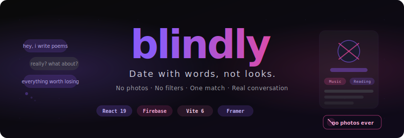
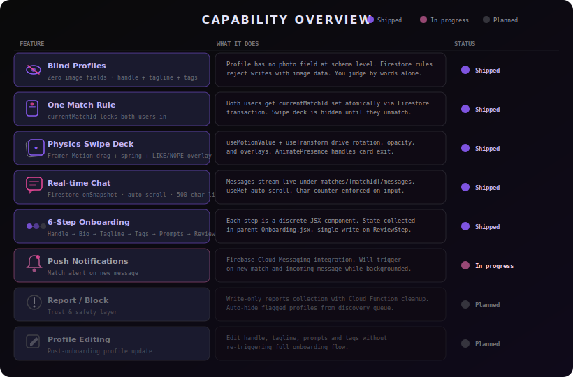
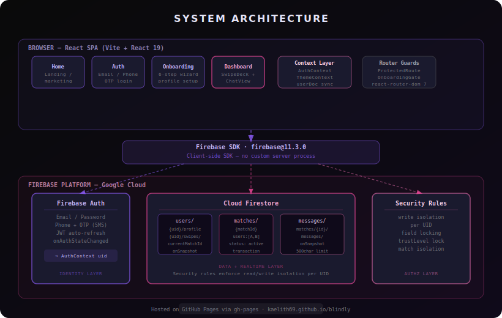
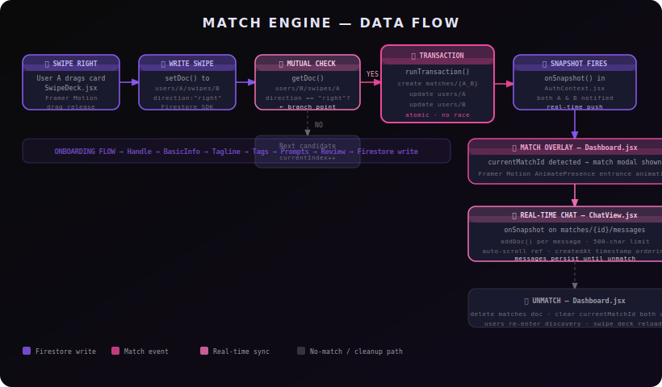
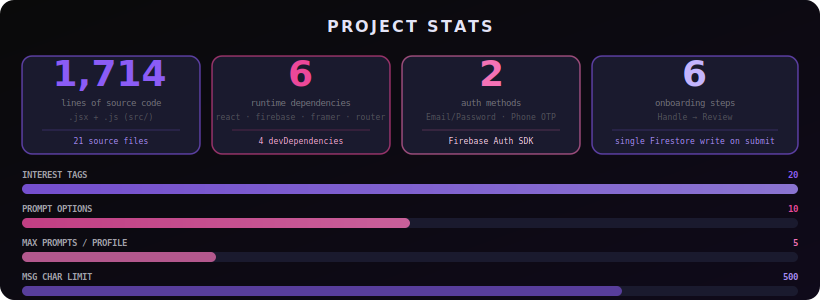

<div align="center">



**No photos. No filters. Just words.**

[Features](#-features) • [Installation](#-installation) • [Usage](#-usage) • [Architecture](#%EF%B8%8F-architecture) • [Roadmap](#-roadmap) • [License](#-license)

</div>

---

*Dating apps broke the deal when they made appearance the first filter. Blindly flips that — your profile is text only, your match is singular, and the conversation is the whole point. Nothing to scroll past.*

**Blindly** is a serverless, text-only blind dating progressive web app built on React 19, Firebase, and Framer Motion. There are no profile photos, no photo uploads, and no image fields anywhere in the data model. Users create a handle, a tagline, pick interest tags from a curated list, and write answers to personal prompts. Discovery is a physics-driven swipe deck. A mutual right-swipe triggers an atomic Firestore transaction that locks both users into a single shared chat. That's the entire product.

---

<div align="center">


[](https://kaelith69.github.io/blindly/)

</div>

---

## 🗂 System Overview

Blindly is a single-page React application with no custom backend. Firebase handles every server-side concern: authentication (Email/Password and Phone OTP), real-time data via Firestore `onSnapshot`, and authorization via server-enforced security rules. The entire app state flows through two React contexts — `AuthContext` (identity + live userDoc sync) and `ThemeContext` (AMOLED dark / light toggle). The match engine runs client-side inside a Firestore transaction.

```
blindly/
├── public/                     # Static assets (SVGs)
├── assets/                     # README diagram assets
├── src/
│   ├── components/
│   │   ├── onboarding/         # 6 discrete step components
│   │   ├── SwipeDeck.jsx       # Physics swipe + match transaction
│   │   ├── ProfileCard.jsx     # Text-only profile display
│   │   ├── ChatView.jsx        # Real-time message stream
│   │   ├── ProfileView.jsx     # Full profile modal
│   │   ├── BottomNav.jsx       # Tab navigation
│   │   ├── AuthForm.jsx        # Login / sign-up form
│   │   ├── OnboardingGate.jsx  # Redirect if profile incomplete
│   │   └── ProtectedRoute.jsx  # Redirect if unauthenticated
│   ├── context/
│   │   ├── AuthContext.jsx     # onAuthStateChanged + onSnapshot
│   │   └── ThemeContext.jsx    # Dark / light mode
│   ├── layouts/
│   │   └── AppLayout.jsx       # Shared chrome for app routes
│   ├── pages/
│   │   ├── Home.jsx            # Landing / marketing
│   │   ├── Auth.jsx            # Auth page wrapper
│   │   ├── Onboarding.jsx      # 6-step wizard coordinator
│   │   └── Dashboard.jsx       # Main app: swipe deck + chat
│   ├── App.jsx                 # Router definition + guards
│   ├── main.jsx                # React root mount
│   ├── constants.js            # AVAILABLE_TAGS, AVAILABLE_PROMPTS
│   ├── firebase.js             # SDK init + db/auth exports
│   └── index.css               # Design system, CSS custom properties
├── scripts/
│   └── seed-profiles.mjs       # Dev utility: populate test profiles
├── firestore.rules             # Server-side authorization
├── firebase.json               # Firebase project config
├── vite.config.js
└── package.json
```

See the [architecture diagram](#%EF%B8%8F-architecture) for the full system view.

---

## ✨ Features

| Feature | What it actually does |
|---|---|
| 🙈 **Blind Profiles** | No `photoURL` field exists at schema level. Firestore rules reject image writes. You see handle, tagline, tags, and prompt answers — nothing else. |
| 💜 **One Match Rule** | `currentMatchId` on both user documents is set atomically in a single Firestore `runTransaction`. You cannot swipe while matched. |
| 🃏 **Physics Swipe Deck** | `useMotionValue` drives card rotation and LIKE/NOPE overlay opacity in real time. `AnimatePresence` handles the spring-exit on swipe completion. |
| 💬 **Real-time Chat** | `onSnapshot` on `matches/{matchId}/messages` streams messages live. Auto-scroll via `useRef`. 500-character hard limit enforced on input. |
| 🔐 **Dual Auth** | Firebase Authentication — Email/Password for standard sign-up, Phone OTP for passwordless. Short-lived JWTs refreshed automatically. |
| 🌙 **AMOLED Theme** | Pure `#000000` dark mode via CSS custom properties. `ThemeContext` toggles the `data-theme` attribute on the root element. |
| 🧭 **6-Step Onboarding** | Discrete components for Handle → BasicInfo → Tagline → Tags → Prompts → Review. State collected in `Onboarding.jsx`, written to Firestore in a single `setDoc` on the final step. |
| 🔒 **Firestore Rules** | Profile writes isolated per UID. Swipe subcollection inaccessible to other users. Auth token required for all reads/writes. |
| ♿ **Accessibility** | All interactive elements carry `aria-label` / `title`. Swipe actions have keyboard-accessible Pass/Like buttons. WCAG AA contrast in both themes. |

---

## 🎛 Capability Visualization



---

## 🏗️ Architecture



Blindly has three logical layers. The **browser layer** is a React 19 SPA bundled by Vite 6, using React Router DOM 7 for client-side routing. Two route guards (`ProtectedRoute`, `OnboardingGate`) sit at the router level — an unauthenticated user never reaches the app shell, and a user with an incomplete profile can't skip onboarding by typing a URL. The **Firebase SDK bridge** is the only communication channel between the browser and the backend; there is no Express server, no REST API, no GraphQL layer.

The **Firebase platform layer** provides three services. Firebase Auth handles identity: it issues short-lived JWTs that the Firestore SDK attaches to every request. Cloud Firestore handles data: three collections (`users`, `matches`, and the `messages` sub-collection) store all app state. Security Rules act as the authorization layer — the client application never runs privileged code; everything it can and can't do is enforced server-side by Firestore before any data is touched. This means the frontend code is inherently limited: it can't escalate privileges by modifying the SDK.

The match engine runs inside `SwipeDeck.jsx`. When User A swipes right, it writes a swipe document and then reads whether User B already swiped right on A. If yes, it calls `runTransaction` — which atomically creates the match document and updates `currentMatchId` on both user documents. Both users' `onSnapshot` listeners fire within milliseconds, and `AuthContext` distributes the new state throughout the component tree without any manual refetch.

---

## 🔄 Data Flow



The primary match-engine path:

```
User A swipes right on User B
  │
  ├─ setDoc(users/A/swipes/B, { direction: "right" })
  │
  ├─ getDoc(users/B/swipes/A) ──── direction != "right" ──▶  next card
  │                                        │
  │                               direction == "right"
  │                                        │
  └─ runTransaction() ─────────────────────┘
       ├─ create  matches/{A_B}  { users:[A,B], status:"active" }
       ├─ update  users/A        { currentMatchId: "A_B" }
       └─ update  users/B        { currentMatchId: "A_B" }
             │
             └─ onSnapshot fires in AuthContext (both users)
                   │
                   └─ Dashboard renders match overlay
                         │
                         └─ ChatView streams matches/{A_B}/messages
```

---

## 🚀 Installation

### Prerequisites

| Requirement | Version | Why |
|---|---|---|
| Node.js | ≥ 18 | ESM support required by Vite 6 |
| npm | ≥ 9 | Workspace-aware lockfile format |
| Firebase project | any | Auth + Firestore must be enabled |
| Firebase CLI | ≥ 13 | For deploying Firestore security rules |

You need a Firebase project with **Authentication** (Email/Password and Phone providers enabled) and **Cloud Firestore** (native mode). Storage does not need to be enabled — Blindly doesn't use it.

### Steps

1. **Clone the repository**
   ```bash
   git clone https://github.com/Kaelith69/blindly.git
   cd blindly
   ```

2. **Install dependencies** — Vite, React, Firebase, Framer Motion, React Router, Lucide icons:
   ```bash
   npm install
   ```

3. **Configure Firebase** — Open `src/firebase.js` and replace the `firebaseConfig` object with your project's credentials from the [Firebase Console](https://console.firebase.google.com/) → Project Settings → Your Apps:
   ```js
   const firebaseConfig = {
     apiKey: "YOUR_API_KEY",
     authDomain: "YOUR_PROJECT.firebaseapp.com",
     projectId: "YOUR_PROJECT_ID",
     storageBucket: "YOUR_PROJECT.firebasestorage.app",
     messagingSenderId: "YOUR_SENDER_ID",
     appId: "YOUR_APP_ID"
   }
   ```

4. **Deploy Firestore security rules** — The rules in `firestore.rules` enforce write isolation per user. Deploy them before testing so your dev environment matches production:
   ```bash
   firebase deploy --only firestore:rules
   ```

5. **Start the development server**:
   ```bash
   npm run dev
   ```
   Vite starts at `http://localhost:5173` with HMR.

### Seed Test Profiles (Optional)

The swipe deck needs other user profiles to show you. A seed script is included:
```bash
node scripts/seed-profiles.mjs
```
This writes synthetic profiles to your Firestore `users` collection. Don't run it against production.

---

## 🖥 Usage

1. **Sign up** at `/auth` — choose Email/Password or Phone OTP.
2. **Complete onboarding** — you'll be redirected to `/onboarding`. Work through all 6 steps. Nothing is written to Firestore until you hit submit on the final Review step.
3. **Discover** — swipe right (or tap Like) to express interest. Swipe left (or tap Pass) to skip. Candidates who've already been swiped on don't reappear.
4. **Match** — if the other person has already swiped right on you, a match overlay appears immediately. Both users are now locked into this conversation.
5. **Chat** — messages appear in real time on both ends. 500-character limit per message.
6. **Unmatch** — tap the unmatch button in the chat header to clear the match and return to discovery.

> **Pro tip:** If the swipe deck shows "No more profiles," it means either everyone in your Firestore has been swiped or there are no other `onboardingCompleted: true` users. Run the seed script (`node scripts/seed-profiles.mjs`) against your dev project to repopulate.

---

## 📁 Project Structure

```
blindly/
├── 🌐 public/
│   ├── hero-banner.svg          # SVG displayed in browser tab / OG
│   └── sparkle-icon.svg         # Favicon
│
├── 🖼 assets/                   # README diagram SVGs (not served)
│   ├── hero-banner.svg
│   ├── architecture.svg
│   ├── data-flow.svg
│   ├── capabilities.svg
│   └── stats.svg
│
├── 📦 src/
│   ├── components/
│   │   ├── onboarding/
│   │   │   ├── HandleStep.jsx       # Step 1: pick a unique handle
│   │   │   ├── BasicInfoStep.jsx    # Step 2: birth year, gender, city
│   │   │   ├── TaglineStep.jsx      # Step 3: one-line profile tagline
│   │   │   ├── TagsStep.jsx         # Step 4: pick up to N interest tags
│   │   │   ├── PromptsStep.jsx      # Step 5: answer personal prompts
│   │   │   └── ReviewStep.jsx       # Step 6: review + single Firestore write
│   │   ├── SwipeDeck.jsx            # Framer Motion swipe + match transaction
│   │   ├── ProfileCard.jsx          # Text-only profile card component
│   │   ├── ChatView.jsx             # Real-time message stream + input
│   │   ├── ProfileView.jsx          # Full profile modal overlay
│   │   ├── BottomNav.jsx            # Bottom tab navigation bar
│   │   ├── AuthForm.jsx             # Combined login / sign-up form
│   │   ├── OnboardingGate.jsx       # Redirect guard: onboardingCompleted?
│   │   └── ProtectedRoute.jsx       # Redirect guard: authenticated?
│   │
│   ├── context/
│   │   ├── AuthContext.jsx          # onAuthStateChanged + userDoc onSnapshot
│   │   └── ThemeContext.jsx         # data-theme attribute toggle
│   │
│   ├── layouts/
│   │   └── AppLayout.jsx            # Shared header + Outlet for /app/*
│   │
│   ├── pages/
│   │   ├── Home.jsx                 # Public landing page
│   │   ├── Auth.jsx                 # Login / sign-up page
│   │   ├── Onboarding.jsx           # 6-step onboarding coordinator
│   │   └── Dashboard.jsx            # Main app: deck, chat, match overlay
│   │
│   ├── App.jsx                      # BrowserRouter + Routes definition
│   ├── main.jsx                     # ReactDOM.createRoot entry point
│   ├── constants.js                 # AVAILABLE_TAGS, AVAILABLE_PROMPTS arrays
│   ├── firebase.js                  # SDK init, exports db and auth
│   └── index.css                    # All styles via CSS custom properties
│
├── ⚙️  scripts/
│   └── seed-profiles.mjs            # Dev-only: write test user documents
│
├── firestore.rules                  # Server-side security rules
├── firebase.json                    # Firebase CLI project config
├── vite.config.js                   # Vite + React plugin config
└── package.json
```

---

## 📊 Performance Stats



---

## 🔒 Privacy

Blindly collects the minimum data required to function:

- **No photo storage** — The Firestore schema has no image fields. Firebase Storage is not enabled. Appearance is structurally excluded from the system.
- **No real name** — The profile has a handle, not a legal name.
- **No precise location** — Approximate city is an optional text field. GPS is never requested.
- **Swipe history** stays in your own `users/{uid}/swipes/` subcollection. Other users can't read it.
- **Chat messages** are plain text only. No files, images, or link previews.
- **Auth tokens** are short-lived JWTs managed by the Firebase SDK. Passwords are hashed by Firebase (bcrypt). Blindly never touches your raw password.
- **No analytics, no ads, no third-party tracking scripts.**

See [`wiki/Privacy.md`](wiki/Privacy.md) for the full privacy model and known limitations.

---

## 🗺 Roadmap

### Core
- [x] Text-only profile creation (6-step onboarding)
- [x] Physics swipe deck (Framer Motion)
- [x] Atomic match detection via Firestore transaction
- [x] Real-time chat (onSnapshot)
- [x] Unmatch flow
- [x] Dark / light theme (AMOLED)

### Trust & Safety
- [ ] Cloud Function for symmetric unmatch cleanup (delete match doc + both currentMatchIds)
- [ ] Report / block users (write-only `reports` collection)
- [ ] Field-level Firestore rules (lock `trustLevel`, `onboardingCompleted`)
- [ ] Restrict match/message reads to participants only

### Product
- [ ] Profile editing after onboarding
- [ ] Push notifications on match and new message (Firebase Cloud Messaging)
- [ ] Conversation time-boxing (24-hour chat windows)
- [ ] Candidate filtering (age range, proximity)
- [ ] Account deletion self-service UI

---

## 📦 Packaging

```bash
# Production build (output to dist/)
npm run build

# Preview the production build locally
npm run preview

# Deploy to GitHub Pages
npm run deploy
```

`npm run deploy` runs `vite build` first (via `predeploy`), then uses `gh-pages` to push `dist/` to the `gh-pages` branch of the repository.

---

## 🤝 Contributing

Fork the repo, create a `feat/*` or `fix/*` branch, and open a PR against `main`. There's no automated test suite — use the manual testing checklist in [`wiki/Contributing.md`](wiki/Contributing.md).

---

## 🛡 Security

Found a vulnerability? Open a GitHub Issue with `[Security]` in the title, or contact the maintainer directly. Don't post exploits in public. See [`wiki/Privacy.md`](wiki/Privacy.md) for known limitations in the current security posture.

---

## 📄 License

MIT — see [`LICENSE`](LICENSE).

<div align="center">

Built with 💜 by [Kaelith69](https://github.com/Kaelith69)

</div>
